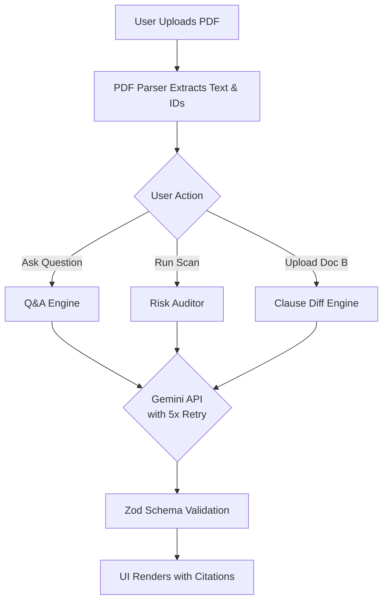

# 📄 Grounded Legal Document Assistant

   

A modern, offline-tolerant, and secure AI assistant for querying, auditing, and comparing legal documents with exact paragraph-level citations to prevent hallucinations.

---

## 📑 Table of Contents

- [Overview](#-overview)
- [Key Features](#-key-features)
- [🚨 CRITICAL: API KEY SETUP 🚨](#-critical-api-key-setup-)
- [How It Works (Architecture)](#-how-it-works-architecture)
- [Getting Started](#-getting-started)
- [Mock Mode / Offline Development](#-mock-mode--offline-development)
- [Deployment](#-deployment)

---

## 📖 Overview

The **Grounded Legal Document Assistant** is designed to process complex contracts and legal documents using the power of Google's Gemini models. It stands apart from standard AI chatbots by strictly enforcing **grounding** — meaning it will only answer based on the uploaded text, and it explicitly cites the exact chunk/paragraph it used to generate the answer.

---

## ✨ Key Features

1. **Grounded Q&A**: Ask questions about your document. The AI cites the exact `[ID: ¶...]` that contains the answer and refuses to guess if the answer is missing.
2. **Automated Risk Scanning**: Instantly audits a contract for Obligations, Liabilities, and Inconsistencies.
3. **Clause-Level Diffing**: Upload Document A and Document B to generate a precise comparison table showing added, removed, and changed clauses.
4. **Resilient AI Execution**: The API integration uses robust retry-mechanisms (up to 5 retries) and exponential backoff to handle rate limits and transient errors on any Gemini API key.

---

## 🚨 CRITICAL: API KEY SETUP 🚨

> [!CAUTION]
> **YOU MUST PROVIDE YOUR OWN API KEY FOR THIS PROJECT TO WORK IN PRODUCTION.**

The AI features require a valid Google Gemini API key. Without this key, the application will not be able to process actual documents unless running in local Mock Mode.

1. Get an API key from [Google AI Studio](https://aistudio.google.com/).
2. Create a file named `.env.local` in the root of the project.
3. Add the following line to the file:

```env
GEMINI_API_KEY="your_actual_gemini_api_key_here"
MOCK_MODE=false
```

Make sure your API key has sufficient quota. The application is highly optimized and includes a 5-retry resilience mechanism to maximize stability regardless of which API key tier you are using.

---

## ⚙️ How It Works (Architecture)



### The "No Hallucination" Guarantee
When you ask a question, the system provides a confidence score and a clickable citation. If the document doesn't contain the answer, the AI is instructed to return a `NOT_FOUND` state instead of hallucinating outside knowledge.

---

## 🚀 Getting Started

### Prerequisites
- Node.js 18+
- npm, yarn, pnpm, or bun

### Installation

1. **Install dependencies:**
   ```bash
   npm install
   ```
2. **Set up environment variables:**
   Follow the [API Key Setup](#-critical-api-key-setup-) instructions above.
3. **Run the development server:**
   ```bash
   npm run dev
   ```
4. **Open your browser:**
   Navigate to [http://localhost:3000](http://localhost:3000).

---

## 🛠 Mock Mode / Offline Development

If you do not have an API key right now or are working offline, you can use **Mock Mode**.

In your `.env.local`:
```env
MOCK_MODE=true
```

When Mock Mode is active, the app uses a deterministic local dataset to simulate the Gemini API responses without making network requests. This allows you to build and preview the UI immediately.

> [!WARNING]
> Mock Mode is strictly prevented from running in production. If deployed with Mock Mode enabled, the UI will throw a visible red banner error to prevent accidental shipping of hardcoded data.

---

## 🌐 Deployment

The easiest way to deploy this Next.js app is to use the [Vercel Platform](https://vercel.com/new).
Be sure to add your `GEMINI_API_KEY` to your production environment variables in your Vercel dashboard!
