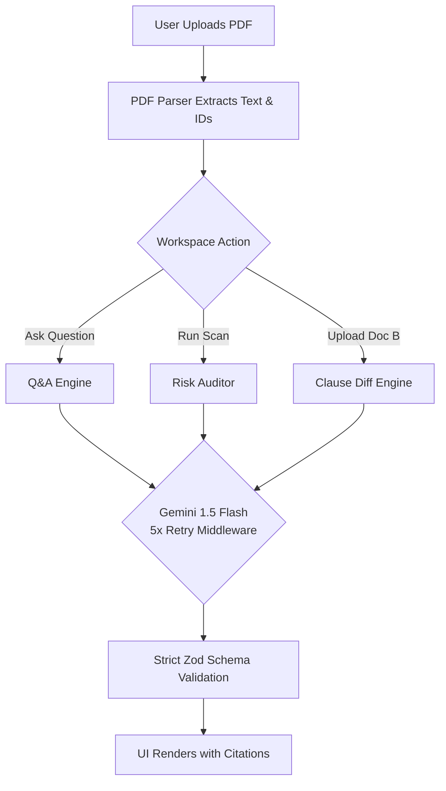

# ⚖️ Legal AI
<div align="center">
  
</div>

<div align="center">
  
   
   
   
  
  

</div>

<br />

> **A highly advanced, scalable AI SaaS platform for enterprise legal teams.** Analyze contracts, extract risk profiles, and compare clauses with pinpoint paragraph-level citations—guaranteed zero hallucinations.

---

## 📑 Table of Contents

- [Overview](#-overview)
- [Enterprise SaaS Features](#-enterprise-saas-features)
- [🚨 CRITICAL: API KEY SETUP 🚨](#-critical-api-key-setup-)
- [How It Works (Architecture)](#-how-it-works-architecture)
- [Getting Started](#-getting-started)
- [Deployment](#-deployment)

---

## 📖 Overview

The **Legal AI** is an institutional-grade platform built on Google's Gemini models (`gemini-1.5-flash`). It is designed to process complex contracts and legal documents while strictly enforcing **grounding**. It will only answer based on the uploaded text and explicitly cites the exact `[ID: ¶...]` used to generate the answer, eliminating external knowledge hallucination.

This repository contains the complete frontend UI, interactive SaaS overlays, and the secure backend actions required to run the platform.

---

## ✨ Enterprise SaaS Features

The application is built to scale and includes professional SaaS-level UI and features:

1. **Grounded Q&A**: Ask any question about a document. The AI cites the exact chunk containing the answer. If the answer is missing, it refuses to guess.
2. **Automated Risk Scanning**: Instantly audits a contract for Obligations, Liabilities, and Inconsistencies with color-coded severity levels.
3. **Clause-Level Diffing**: Upload Document A and Document B to generate a precise comparison table showing added, removed, and changed clauses.
4. **Resilient AI Execution**: The API integration uses robust 5-retry mechanisms and exponential backoff to handle rate limits and ensure uptime.
5. **Interactive Modal System**: Fully integrated, glassmorphic UI overlays for:
   - **Features & Pricing Plans** (Free, Pro, Pro Max)
   - **Enterprise Scalability** (On-Premise & VPC Deployments, SOC2/HIPAA)
   - **API Documentation** for developers to connect using their own billing.
   - **Animated Workspace Login** with immersive CSS micro-animations.

---

## 🚨 CRITICAL: API KEY SETUP 🚨

> [!CAUTION]
> **YOU MUST PROVIDE A REAL API KEY FOR THIS PROJECT TO WORK.**
> The previous placeholder/mock system has been completely removed to ensure true functionality.

The AI engine requires a valid Google Gemini API key to process actual documents.

1. Get an API key from [Google AI Studio](https://aistudio.google.com/).
2. Create a file named `.env.local` in the root of the project.
3. Add the following line to the file:

```env
GEMINI_API_KEY="your_actual_gemini_api_key_here"
```

*Note: Make sure your API key has sufficient quota. The application is highly optimized and includes a 5x retry resilience mechanism to maximize stability regardless of which API key tier you are using.*

---

## ⚙️ How It Works (Architecture)



### The "No Hallucination" Guarantee
When you ask a question, the system provides a confidence score and a clickable citation. If the document doesn't contain the answer, the AI is instructed to return a `NOT_FOUND` state instead of hallucinating outside knowledge.

---

## 🚀 Getting Started

### Prerequisites
- Node.js 18+
- npm, yarn, pnpm, or bun

### Installation

1. **Install dependencies:**
   ```bash
   npm install
   ```
2. **Set up environment variables:**
   Follow the [API Key Setup](#-critical-api-key-setup-) instructions above to add your live key.
3. **Run the development server:**
   ```bash
   npm run dev
   ```
4. **Open your browser:**
   Navigate to [http://localhost:3000](http://localhost:3000) to access the workspace.

---

## 🌐 Deployment

This application is a standard Next.js 14 App Router project and can be deployed to any major cloud provider (AWS, GCP, Azure) or Next.js hosting platform of your choice.

When deploying, ensure that `GEMINI_API_KEY` is securely injected into your production environment variables. For enterprise usage, refer to the in-app **Enterprise** tab for instructions on VPC and air-gapped deployments.
