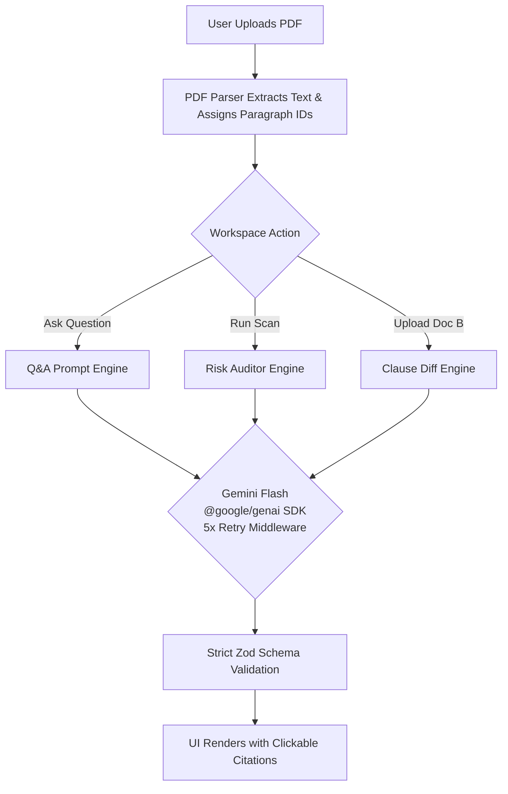

# ⚖️ Legal AI

<div align="center">
  
</div>

<div align="center">
  
   
   
   
  
  

</div>

<br />

> **A highly advanced, scalable AI SaaS platform for enterprise legal teams.** Analyze contracts, extract risk profiles, and compare clauses with pinpoint paragraph-level citations—guaranteed zero hallucinations.

---

## 📑 Table of Contents

- [The Problem](#-the-problem)
- [Our Solution](#-our-solution)
- [Enterprise SaaS Features](#-enterprise-saas-features)
- [🚨 CRITICAL: API KEY SETUP 🚨](#-critical-api-key-setup-)
- [How It Works (Architecture)](#-how-it-works-architecture)
- [Security & Performance](#-security--performance)
- [Getting Started](#-getting-started)

---

## 🛑 The Problem

In the modern corporate world, legal teams spend thousands of hours manually reviewing lengthy contracts, MSAs, and NDAs. When they attempt to use traditional Large Language Models (LLMs) to speed up this process, they run into a critical roadblock: **Hallucinations**.

Generic LLMs often confidently invent clauses, misinterpret legal jargon, or draw upon outside internet knowledge rather than the actual document in front of them. In the legal sector, a hallucinated liability cap or a fabricated indemnification clause is not just an error—it is a catastrophic risk that could cost millions. 

Furthermore, existing tools lack the ability to instantly diff two versions of a contract or automatically flag hidden obligations without tedious manual reading.

---

## 💡 Our Solution

**Legal AI** is built from the ground up to solve the hallucination problem through **Strict Document Grounding**. Powered by the latest Google Gemini API (`gemini-3.8-flash` via the `@google/genai` SDK), our platform acts as a digital paralegal that *only* knows what is in the document you upload.

Every answer generated by Legal AI is backed by a **verifiable citation**. If the AI claims a contract requires a 30-day termination notice, it provides a clickable reference (e.g., `[ID: ¶4]`) pointing to the exact paragraph. If the answer is not in the text, the AI is strictly prompted to return a `NOT_FOUND` response rather than guessing.

---

## ✨ Enterprise SaaS Features

The application is built to scale and includes professional SaaS-level UI and features out-of-the-box:

1. **Grounded Q&A Engine**: Ask any question about a document. The AI cites the exact chunk containing the answer. If the answer is missing, it refuses to guess.
2. **Automated Risk Scanning**: Instantly audits a contract for Obligations, Liabilities, and Inconsistencies. It extracts these risks and presents them with color-coded severity levels.
3. **Clause-Level Diffing**: Upload Document A and Document B to generate a precise comparison table showing exactly what was added, removed, or changed.
4. **Resilient AI Execution**: The API integration uses robust 5-retry mechanisms and exponential backoff to handle rate limits and ensure maximum uptime.
5. **Interactive UI & Splash Screen**: Fully integrated, glassmorphic UI overlays featuring:
   - Immersive CSS micro-animations and loading states.
   - **Features & Pricing Plans** (Free, Pro, Pro Max).
   - **Enterprise Scalability** documentation (On-Premise & VPC Deployments).
   - **API Documentation** for developers.

---

## 🚨 CRITICAL: API KEY SETUP 🚨

> [!NOTE]
> **Live Demo:** The live production deployment of this application on Vercel is already configured with a working Google Gemini API key and is **fully functional out of the box**.
>
> **Local Development:** If you clone this repository to run it locally on your own machine, you **must provide your own API key** for the AI engine to process documents.

If running locally:
1. Get an API key from [Google AI Studio](https://aistudio.google.com/).
2. Create a file named `.env.local` in the root of the project.
3. Add the following line to the file:

```env
GEMINI_API_KEY="AQ.Your_Actual_API_Key_Here"
MOCK_MODE=false
```

---

## ⚙️ How It Works (Architecture)



### The "No Hallucination" Guarantee
When a document is uploaded, it is parsed into semantic chunks, and each chunk is assigned a unique ID. The AI is fed these chunks and instructed to respond in a strict JSON schema that requires citing the ID. This ensures absolute traceability for every legal claim made by the assistant.

---

## 🔒 Security & Performance

Built with enterprise standards in mind:
- **Security Headers**: Configured with strict `X-Frame-Options`, `X-Content-Type-Options`, and `Permissions-Policy` to prevent clickjacking and XSS.
- **Input Validation**: Hardened server actions with 20MB file size limits and maximum character lengths to prevent prompt injection and DoS attacks.
- **Optimized Assets**: Utilizes Next.js `<Image>` component with AVIF/WebP formatting and `priority` loading for perfect Core Web Vitals.
- **Edge Ready**: Fully compatible with Vercel Edge caching and serverless function execution.

---

## 🚀 Getting Started

### Prerequisites
- Node.js 18+
- npm, yarn, pnpm, or bun

### Installation

1. **Clone & Install:**
   ```bash
   git clone https://github.com/vaibhavvvvjain03/Legal-AI.git
   cd Legal-AI
   npm install
   ```
2. **Environment Variables:**
   Set up your `.env.local` file as shown in the API Key Setup section.
3. **Run the server:**
   ```bash
   npm run dev
   ```
4. **Open your browser:**
   Navigate to [http://localhost:3000](http://localhost:3000).
